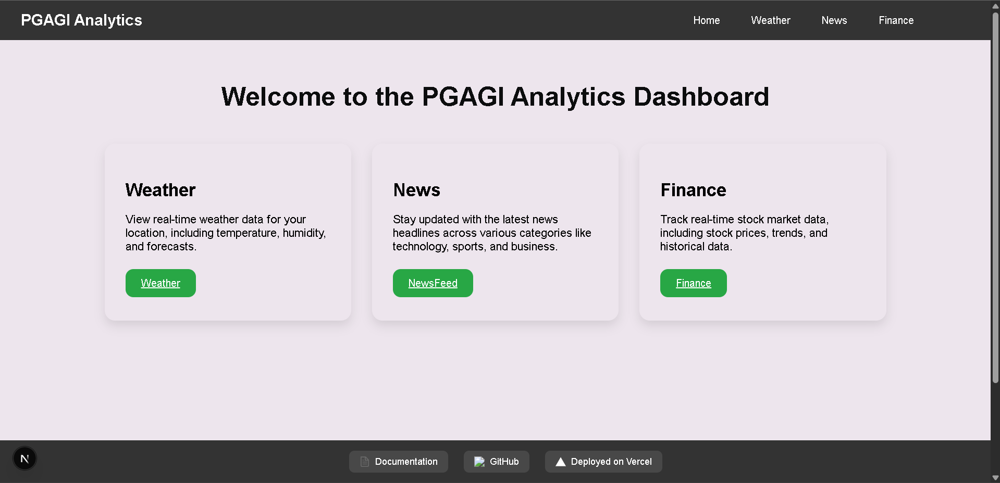
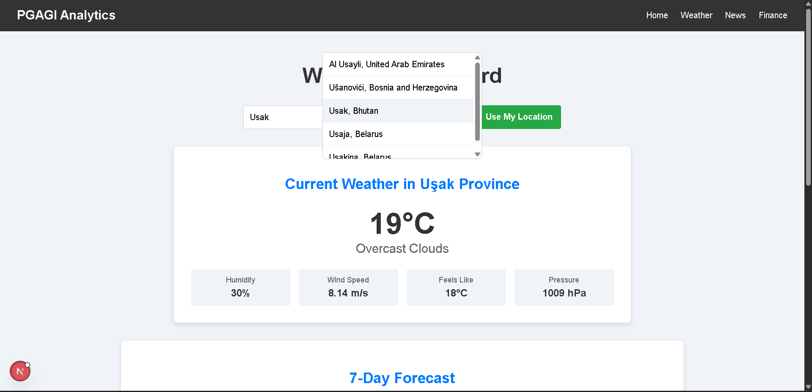
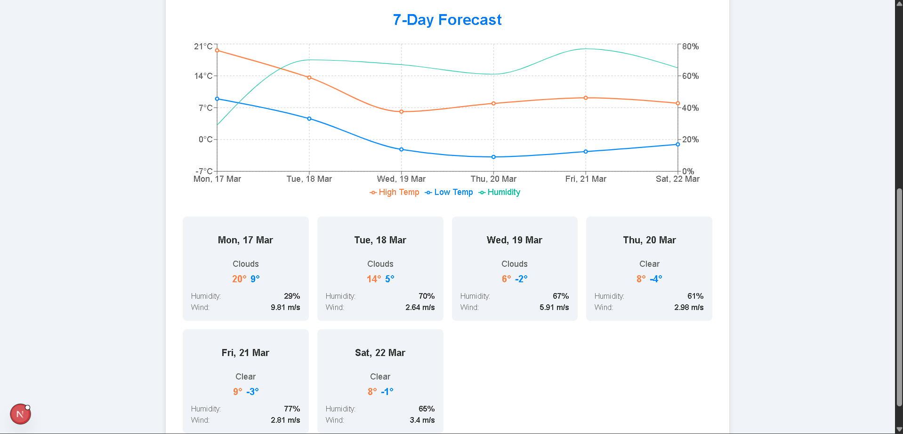
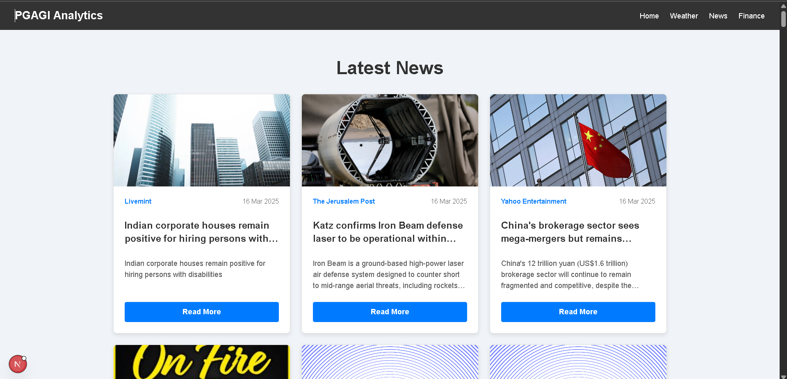
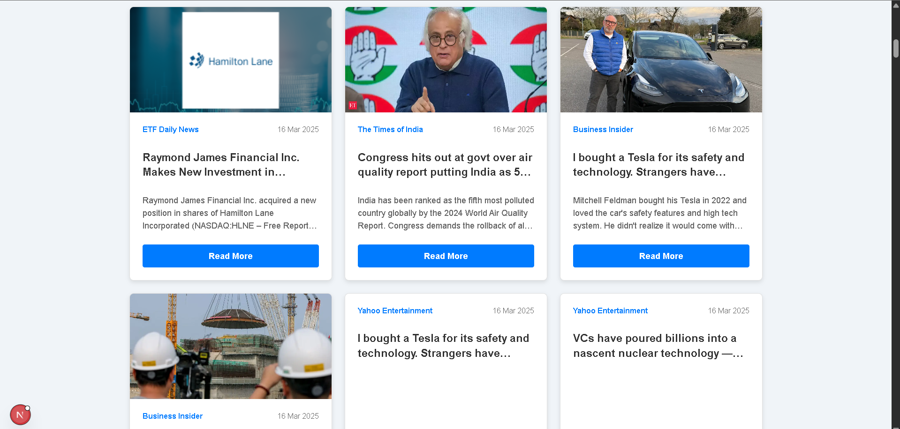
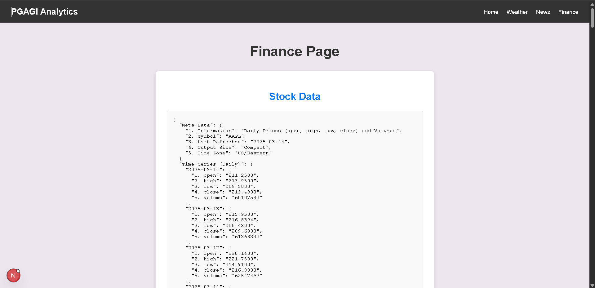

This is a [Next.js](https://nextjs.org) project bootstrapped with [`create-next-app`](https://nextjs.org/docs/app/api-reference/cli/create-next-app).

## ** PGAGI - Comprehensive Analytics Dashboard **

   ```bash
     
    PGAGI is an AI-based startup committed to delivering cutting-edge in a fast-paced 
    development environment. We value creativity, efficiency, and the ability to deliver 
    high-quality user experiences. This advanced assignment is designed to assess your 
    proficiency in modern front-end technologies, your ability to architect complex 
    applications, and your skill in creator-standarding dynamic, user-friendly interfaces with 
    high performance and accessibility . 

  ```  


# News Feed Application

This is a [Next.js](https://nextjs.org) project bootstrapped with [`create-next-app`](https://nextjs.org/docs/app/api-reference/cli/create-next-app). It is a News Feed application that displays a grid of news articles fetched from an API. The application features a responsive design, a navbar, and a grid layout for displaying news cards with images, titles, descriptions, and "Read More" links.

## Features

1. **Responsive Design**:
   - The application is fully responsive and adapts to different screen sizes using CSS Grid and Flexbox.

2. **News Grid Layout**:
   - News articles are displayed in a grid layout with a minimum card width of 300px.
   - Each card includes an image, title, description, and a "Read More" link.

3. **Hover Effects**:
   - News cards have hover effects that slightly lift the card and add a shadow for better user interaction.

4. **Dynamic Image Handling**:
   - If an article does not have an image, a placeholder image is displayed.

5. **Navbar**:
   - A fixed navbar at the top with a logo and navigation links.

6. **CSS Modules**:
   - Styles are scoped using CSS Modules to avoid global conflicts.

7. **External Links**:
   - "Read More" links open the full article in a new tab using `target="_blank"` and `rel="noopener noreferrer"`.

8. **Next.js Optimizations**:
   - Built-in support for server-side rendering (SSR) and static site generation (SSG).
   - Automatic font optimization using [`next/font`](https://nextjs.org/docs/app/building-your-application/optimizing/fonts) for [Geist](https://vercel.com/font), a font family by Vercel.

## Technologies Used

- **Next.js**: A React framework for server-rendered applications.
- **React**: A JavaScript library for building user interfaces.
- **CSS Modules**: For scoped and modular CSS styling.
- **HTML5**: For structuring the application.
- **JavaScript (ES6+)**: For dynamic functionality.

## Getting Started

### Prerequisites

- Node.js and npm installed on your machine. You can download them from [here](https://nodejs.org/).

### Steps

1. **Clone the Repository**:
   ```bash
   git clone https://github.com/your-username/news-feed-app.git
   cd news-feed-app

Open [http://localhost:3000](http://localhost:3000) with your browser to see the result.

You can start editing the page by modifying `app/page.tsx`. The page auto-updates as you edit the file.

This project uses [`next/font`](https://nextjs.org/docs/app/building-your-application/optimizing/fonts) to automatically optimize and load [Geist](https://vercel.com/font), a new font family for Vercel.

## Learn More

To learn more about Next.js, take a look at the following resources:

- [Next.js Documentation](https://nextjs.org/docs) - learn about Next.js features and API.
- [Learn Next.js](https://nextjs.org/learn) - an interactive Next.js tutorial.

You can check out [the Next.js GitHub repository](https://github.com/vercel/next.js) - your feedback and contributions are welcome!

## Deploy on Vercel

The easiest way to deploy your Next.js app is to use the [Vercel Platform](https://vercel.com/new?utm_medium=default-template&filter=next.js&utm_source=create-next-app&utm_campaign=create-next-app-readme) from the creators of Next.js.

Check out our [Next.js deployment documentation](https://nextjs.org/docs/app/building-your-application/deploying) for more details.


## HOW TO RUN THE PROJECT 

# Steps - 

1. **Clone the Repository**:
   ```bash
   git clone https://github.com/your-username/news-feed-app.git
   cd news-feed-app

   ```
2. Install Dependencies:

   ``` cd .\pgagi-analytics-dashboard\
   - npm install

3. npm run dev  


## Screenshots --- 

1. Main Page -

  

2. Weather Page - 

   

   7-days weatherForecaste -

   

3. NewsFeed page - 

   

   

4. Finance Page -

   


## How to run the project -
   1. clone the project
   2. install "npm install"
   3. run "npm run dev"


##### -----------------------------------------------------------------------------------


